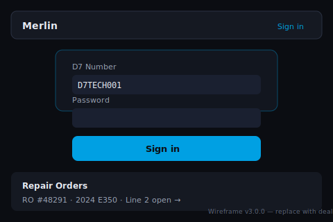
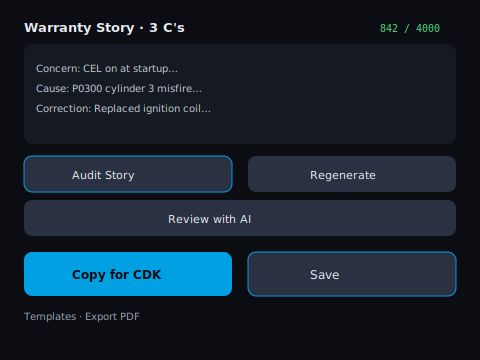

# Merlinus

> **v4.1.0 — Modular Dealership OS + production control plane (MFA, dual-key rotation, Async AI, Control Center).**  
> Start here: **[docs/Modular-OS-Overview.md](./docs/Modular-OS-Overview.md)** — executive summary, shipped modules, architecture, manager go-live steps, and pilot test scenarios.  
> Core warranty RO story is always on; Video MPI, Maintenance, Parts/Sales/Service inboxes, Loaner, and AI Voice are rooftop-entitled modules. Live CDK API sync (PR-M7) is deferred.

**Mercedes-Benz Warranty Narrative Intelligence + Modular Dealership OS**


Warranty narrative system for fixed ops: bay evidence → OEM-aligned stories, audit trail, and optional modular products (Video MPI, departments, loaner, AI voice, calendar hub).

**Readiness:** **Ready for Validation** / Conditional pilot — multi-dealership rollout after secrets, health, and module gates. Production gate: `npm run ready-to-deploy` (exit 0) + **[docs/Production-Readiness-Checklist.md](./docs/Production-Readiness-Checklist.md)** sign-off.  
**Start:** **[docs/Rollout-Runbook.md](./docs/Rollout-Runbook.md)** · ops single source of truth **[docs/Production-Readiness-Checklist.md](./docs/Production-Readiness-Checklist.md)**.

---

## What Is Merlinus?

Merlinus is the enterprise-grade AI platform purpose-built for Mercedes-Benz fixed operations. Technicians capture repair context via voice or tablet. The system instantly generates professional warranty narratives, branded PDFs, and a cryptographically verifiable audit record that satisfies OEM reviewers, internal compliance teams, and multi-rooftop leadership. **v4.0** layers a modular dealership OS on that foundation—enable Video MPI, maintenance tickets, parts/sales/service inboxes, loaner fleet, and AI phone agents per rooftop without disabling core story.

Designed in the service bay. Trusted by service directors.

---

## Why Leading Mercedes-Benz Dealers Choose Merlinus

| Outcome | Business Impact |
|---------|-----------------|
| **Warranty narrative speed** | 60–75% reduction in documentation time |
| **First-pass approval rate** | Material increase in OEM acceptance |
| **Audit & chargeback protection** | Immutable hash-chained evidence record |
| **Revenue defense** | Defensible stories for disputes and audits |
| **Technician productivity** | Hours returned to billable work daily |
| **Group visibility & control** | Centralized audit log + usage analytics |

---

## Core Capabilities

- **Voice-First Input** — Hands-free, noise-adaptive capture on shop-floor tablets
- **v3.x Narrative Engine** — Dynamic elite-technician personas, 10-step diagnostic workflow, anti-detection guardrails (always on)
- **Diagnostic Evidence** — RO/Xentry photo capture with auto-save, preview, delete, and vision extraction
- **Audit Story Certification** — MI-aligned quality scoring + mandatory technician certification
- **Customer Pay Instant Mode** — 12+ pre-approved templates (zero AI footprint)
- **Branded Exports** — Professional PDFs with dealership header and audit hash footer
- **Modular product suite (v4)** — Video MPI, Maintenance, Parts/Sales/Service inboxes, Loaner, AI Voice Agent — manager-toggleable entitlements
- **Enterprise Controls** — AES-256-GCM encryption, private blobs, session revocation, rate limiting, maintenance mode
- **Real-time Desktop Companion** — Tablet + desktop stay in sync via Server-Sent Events and SWR (no separate WebSocket process)

---

## Proven Results (Pilot Data)

> "Stories that used to take 20 minutes now leave the bay in under five. When warranty pushes back, the audit trail answers instantly."
>
> — Service Manager, Mercedes-Benz flagship dealership *(live pilot, July 2026)*

**Average pilot outcomes**

- Narrative time: **−68%**
- Technician adoption (30 days): **92%**
- Audit integrity: **100%** verified

*Pilot metrics vary by store size, technician mix, and warranty volume. Reference implementations available on request.*

---

## Quick Start (Under 60 Minutes to Staging)

```bash
git clone https://github.com/Nicequantum/Merlinus.git
cd Merlinus
npm install
cp .env.example .env.local
npm run db:migrate:deploy && npm run db:seed
npm run dev
```

| Step | Action |
|------|--------|
| **1. Clone & install** | Commands above |
| **2. Configure secrets** | Copy `.env.example` → `.env.local`; set database, encryption, and API keys |
| **3. Validate** | `npm run ready-to-deploy` — must exit 0 before production |
| **4. Deploy** | Connect repository to Vercel; apply Production environment variables |
| **5. Roll out** | [Modular OS Overview](./docs/Modular-OS-Overview.md) → [Master Rollout Document](./docs/Master-Rollout-Document.md) → laminate [Bay Reference Cards](./docs/Bay-Reference-Card.md) |

Production rollout: [Go-Live Deployment Checklist](./docs/Go-Live-Deployment-Checklist.md) · [Deployment Checklist & Operations](./docs/Deployment-Checklist-and-Operations.md) · IT setup: [Admin Setup Guide](./docs/Admin-Setup-Guide.md)

---

## Live Demo & Screenshots

| View | Preview |
|------|---------|
| **Technician login & RO list** |  |
| **Voice input panel** |  |
| **Diagnostic evidence grid** |  |
| **Generate MI 4.3 workflow** |  |
| **Story actions & certification** |  |

*Live dealership demo environment available for qualified Mercedes-Benz dealer groups. Contact for pilot access.*

---

## Enterprise Ready

Merlinus **v4.0.0** ships the modular dealership OS (feature-complete minus live CDK API sync) on top of the v3 enterprise hardening baseline — architecture, security, audit integrity, shop-floor UX, and production operations.

**Modular OS:** complete for Video MPI, Maintenance, Parts/Sales/Service, Loaner, Voice — see [Modular OS Overview](./docs/Modular-OS-Overview.md).  
**Security Hardening Sprint (Phases 6.1–6.5): complete and production-ready** — see [Security Fortress](./docs/Security-Fortress.md).  
**Enterprise Readiness Cleanup (Phases 7.1–7.3): complete** — Prisma/RLS consistency, observability, timezone, story AI shell, multi-group switcher.  
**Production Hardened & Ready for Pilot Deploy** — [Production Readiness Checklist](./docs/Production-Readiness-Checklist.md) · [Go-Live Deployment Checklist](./docs/Go-Live-Deployment-Checklist.md).

```
╔══════════════════════════════════════════════════════════════╗
║           MERLINUS ENTERPRISE AUDIT CERTIFICATE              ║
║                                                              ║
║   Score: 99 / 100                                            ║
║   Release: v4.0.0 · Modular Dealership OS                    ║
║   Status: Feature-Complete (CDK live sync deferred)          ║
║          Production Hardened · Pilot-Ready Code              ║
║                                                              ║
║   Core story:          ALWAYS ON (not module-gated)          ║
║   Product modules:     PASS (entitlements + manager toggles) ║
║   Security controls:   PASS (AES-256, CSP, auth, rate limits)║
║   Audit chain:         PASS (SHA-256 hash chain verified)    ║
║   Shop-floor UX:       PASS (voice, scan, story, PDF)        ║
║   Operations:          PASS (health, maintenance, monitoring)║
╚══════════════════════════════════════════════════════════════╝
```

| Documentation | Audience |
|---------------|----------|
| [Modular OS Overview](./docs/Modular-OS-Overview.md) | **v4 start here** — executives, managers, pilot teams |
| [Technical Specification & Architecture](./docs/Technical-Specification-and-Architecture.md) | IT, engineering, integration partners |
| [Compliance, Security, Audit & Legal](./docs/Compliance-Security-Audit-and-Legal.md) | Legal, privacy, OEM security review |
| [Full Enterprise Audit History & Validation](./docs/Full-Enterprise-Audit-History-and-Validation.md) | Due diligence, franchise compliance |
| [Deployment Checklist & Operations](./docs/Deployment-Checklist-and-Operations.md) | Dealership IT, platform operations |
| [Documentation Library](./docs/README.md) | All rollout roles |

---

## Ready for Your Dealership Group

Merlinus is available for **pilot deployment** and **enterprise licensing** across Mercedes-Benz dealer groups, flagship stores, and multi-rooftop fixed-ops organizations.

**Contact for pilot access, licensing, or executive briefing.**

[github.com/Nicequantum/Merlinus](https://github.com/Nicequantum/Merlinus)