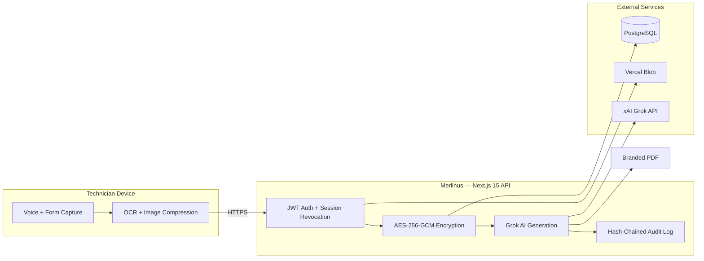

# Merlinus — Technical Specification & Architecture

**Version:** 3.0.0 · **Prompt:** 3.0.0  
**Audience:** Dealership IT, engineering leads, integration partners  
**Classification:** Technical reference

---

## 1. System overview

Merlinus is a Next.js 15 application with a PostgreSQL data layer, Prisma ORM, and server-side AI inference via the xAI Grok API. All sensitive operations execute on authenticated API routes; no AI keys or customer data are exposed to the browser bundle.

### Design principles

| Principle | Implementation |
|-----------|----------------|
| **Server-only AI** | `GROK_API_KEY` never leaves Node runtime; builds fail on `NEXT_PUBLIC_*` xAI keys |
| **Encrypt before persist** | Customer PII and story content encrypted with AES-256-GCM before database write |
| **Audit everything** | AI generation, scoring, review, PDF export, and image access append to hash-chained audit log |
| **Instant session revocation** | JWT sessions invalidate on password change, deactivation, or explicit logout |
| **Shop-floor resilience** | Offline banner, manual typing fallback, error boundaries, maintenance mode |

---

## 2. Architecture diagram



---

## 3. Technology stack

| Layer | Technology |
|-------|------------|
| **Frontend** | Next.js 15, React, TypeScript, Tailwind CSS |
| **API** | Next.js App Router route handlers, Zod validation |
| **Database** | PostgreSQL via Prisma ORM |
| **AI inference** | xAI Grok API (server-side only) |
| **File storage** | Vercel Blob (private diagnostic images) |
| **Rate limiting** | Vercel KV / Upstash Redis (production) |
| **Monitoring** | Sentry (`NEXT_PUBLIC_SENTRY_DSN`) |
| **PDF generation** | jsPDF (client-side branded export) |

---

## 4. Core workflows

### 4.1 Warranty narrative (AI path)

1. Technician opens repair order and repair line
2. Captures symptoms, findings, and repair details via voice or form
3. Optional: attach diagnostic photos (Xentry) or scan RO pages
4. **Generate MI 4.3** invokes Grok with prompt v3.0.0 (veteran technician personas, 10-step workflow)
5. **Audit Story** scores narrative quality; technician certifies before DMS submission
6. Export branded PDF or copy to clipboard for CDK

### 4.2 Customer Pay (template path)

| | Customer Pay | Warranty (AI) |
|---|--------------|-----------------|
| **Story source** | Pre-written template library (`customerPayTemplates.ts`) | Grok AI generation |
| **Quality audit** | Skipped (non-warranty work) | MI-aligned review optional |
| **Audit action** | `customerPayTemplateApplied` (no Merlin `promptVersion`) | `story.generate` / `story.review` with `promptVersion` |
| **UI** | Green “Customer Pay · Instant” badge | Generate + Review with AI |

### 4.3 RO scan & diagnostic evidence

- Multi-page RO capture with on-device OCR fallback and Grok vision extraction
- Xentry diagnostic photos: auto-save, preview, delete, batch processing
- Cancel mid-batch clears pending queue (L5 parity between RO scan and Xentry)

---

## 5. Voice input architecture

Merlinus uses the browser **Web Speech API** for hands-free warranty story entry on rugged tablets.

### Technician modes

| Mode | Action |
|------|--------|
| **Tap to toggle** (default) | Tap mic to start; tap again to stop |
| **Push-to-talk** | Hold mic while speaking |

### Noise robustness

- Parallel microphone stream with auto gain control, noise suppression, echo cancellation
- Adaptive confidence threshold lowers as background noise rises
- Auto-restart recovers from brief silence and recognizer `onend` events
- Listening timeout (45s default) with one-tap Retry

### Browser requirements

| Requirement | Detail |
|-------------|--------|
| **Browser** | Chrome or Edge (Chromium Web Speech API) |
| **Microphone** | Allow mic permission for dealership site |
| **Network** | Cloud speech recognition requires connectivity |
| **Fallback** | Unsupported browsers show “Voice unavailable — type below.” |

### Component architecture

```
StableTextarea / StableInput
        └── VoiceInputButton (UI + animations)
                └── useVoiceInput (React hook)
                        └── VoiceInputService (src/lib/voice/)
                                ├── Web Speech API (continuous + interim)
                                ├── NoiseMonitor (Web Audio RMS)
                                └── Adaptive confidence + error recovery
```

### Configuration

Edit `DEFAULT_VOICE_INPUT_SETTINGS` in `src/lib/voice/voiceSettings.ts`:

- `listeningTimeoutMs`, `maxAutoRestarts`, `silenceRestartDelayMs`
- `baseConfidenceThreshold` / `minConfidenceThreshold` / `noiseAdjustmentFactor`
- `pushToTalkDefault`, `enabled` (master switch)

---

## 6. API route inventory (AI routes)

| Route | maxDuration | Purpose |
|-------|-------------|---------|
| `/api/diagnostics/extract` | 100s | Xentry vision extraction |
| `/api/repair-orders/extract` | 130s | RO page vision extraction |
| `/api/.../generate-story` | 60s | Warranty narrative generation |
| `/api/.../score-story` | 100s | MI quality scoring |
| `/api/.../review-story` | 120s | Story review pass |

All AI routes enforce per-IP rate limits (20/min), daily usage caps (50 AI calls/technician/day default), and `trackUsage` metering.

---

## 7. Data model highlights

| Entity | Notes |
|--------|-------|
| **RepairOrder** | Encrypted RO number, blind-index search tokens, complaint payloads |
| **RepairLine** | Encrypted description, warranty story, Xentry images/OCR, certification metadata |
| **AuditLog** | Append-only SHA-256 hash chain per dealership; `promptVersion` on AI entries |
| **Technician** | D7 login, bcrypt password, role (manager/technician), session version for revocation |
| **UsageLog** | Daily AI call tracking with configurable timezone and cap |

---

## 8. Common failure modes

| Issue | Symptom | Recommended fix |
|-------|---------|-----------------|
| **Grok timeout** | Long loading or timeout error | Shorten input; click **Regenerate** |
| **Voice not working** | Mic button inactive or stops mid-sentence | Allow mic in Chrome/Edge; switch to push-to-talk; use Retry or type manually |
| **PDF generation failed** | “Failed to generate PDF” | Complete required fields; regenerate story |
| **Frequent logouts** | Unexpected session expiry | Verify device clock; clear browser cache |
| **Audit chain warning** | Integrity error in audit log | Stop use; notify Service Manager and IT immediately |

---

## 9. Related documents

| Document | Purpose |
|----------|---------|
| [Compliance, Security, Audit & Legal](./Compliance-Security-Audit-and-Legal.md) | Security controls and legal requirements |
| [Deployment Checklist & Operations](./Deployment-Checklist-and-Operations.md) | Environment variables and go-live procedures |
| [Grok Subprocessor & Data Governance](./GROK-SUBPROCESSOR.md) | xAI data flow for OEM legal review |
| [Admin Setup Guide](./Admin-Setup-Guide.md) | Step-by-step IT provisioning |